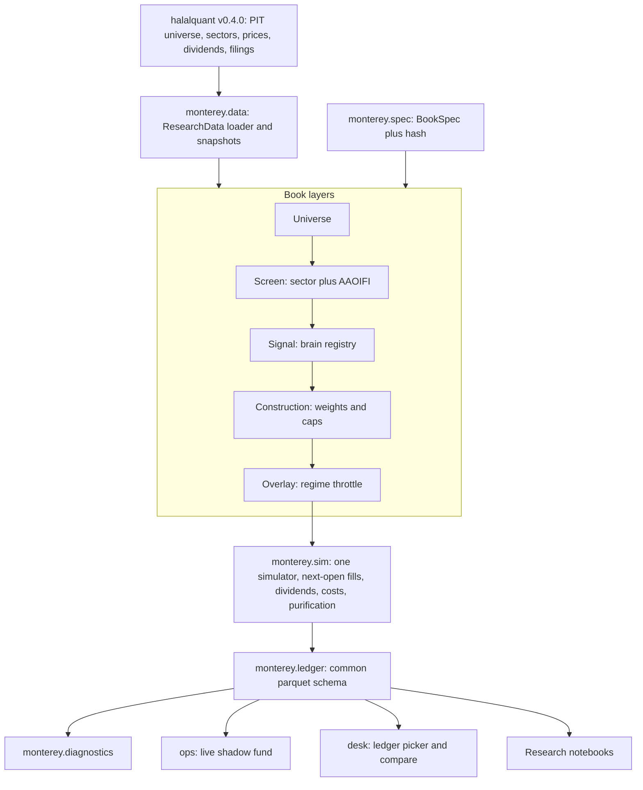

# Fund foundation rebuild (October 2026)

Source of gaps: [Research/diagnostics/README.md](Research/diagnostics/README.md). Rule for the month: **fix the base first, re-baseline, then research.** No new strategy is judged against the current `1b-fcf-sma-v1` ledger.

## Target structure



Every run (live, replay, or notebook experiment) writes the same ledger to `ledgers/<book_id>/<spec_hash>/`. The desk and the diagnostics module only read ledgers. There is no second backtest engine.

## Gap coverage checklist

Each gap from the diagnostics is mapped to the phase that closes it.

- **SPY switch look-ahead in research** (`Research/sleeves/backtest.py` `run_weight_schedule`): Phase 2. One simulator, and every signal acts at the next open. The old engine is retired.
- **Sector screen missing in ops** (`ops/data.py` `cache_symbols`, `sleeves/compliance.py` `halal_pass`): Phases 0 and 2. The screen layer applies sector and AAOIFI tests together and gives a reason code for each name.
- **Dividends never credited:** Phase 2. Accounting posts the gross dividend on the ex-date. The purification slice is then taken from that credited cash.
- **10 bp cost estimated but not charged** (`ops/oms.py` `est_cost`): Phase 2. Every fill is charged the cost and writes a cost cashflow row.
- **Survivorship (today's 503 names, empty `universe_stints`):** Phase 0. Point-in-time membership is persisted, and leavers get prices, filings and dividends.
- **Price-only vs adj_close mismatch:** Phase 2. The simulator trades raw open/close prices and credits dividends as cash. Adjusted prices are used only for signals.
- **Daily churn (32 fills/day, 89% under $2k):** Phase 2 adds `execution.drift_band` and `execution.min_trade`. The v2 baseline keeps v1 behaviour (daily re-target) so the effect is measured, not hidden. Sprint 18 decides the default.
- **Concentration and loose FCF filter:** Phase 2 adds `construction.sector_cap` and the brain registry. Deciding the values is sprint work, not a fix.
- **Desk gaps** (blank beta/alpha/TE, last-fill prices, ratio-only `PASS`, rules taken from code): Phase 4.
- **Runs not reproducible (`book_version` string only):** Phase 1. A `BookSpec` hash is stamped on every ledger row and in the manifest.
- **Storage bloat** (1,695 folders x 19 files, 30 MB `batches.json`, 328 MB `.git`): Phase 3. Append-only parquet ledgers. Git keeps the spec, `nav.parquet` and `diagnostics.json`; bulk tables go to R2.
- **Slow replay** (`ops/quotes.py` `session_quotes` copies the whole price frame per call): Phase 2. Wide open/close panels are built once.

## Phase 0: halalquant v0.4.0

Changes go in `../halalquant`, then the pins move in [.github/workflows/main.yml](.github/workflows/main.yml) and the new `pyproject.toml`.

- **Point-in-time membership.**
  - Persist `sp500_stints()` into `universe_stints` during `prepare_dataset` and `refresh_dataset`. Today `_load_stints` exists, but the cache table has 0 rows.
  - Make `read_universe(as_of=...)` return point-in-time members with `sector` and `sector_allowed`, leavers included.
- **Data for leavers.** Backfill prices, filings, metrics and dividends for every stint member since 2019, not only current members.
- **One-call halal universe.** New `hq.halal_universe(as_of, standard="aaoifi")` returns `symbol, sector, sector_allowed, debt_ratio, cash_ratio, receivables_ratio, is_compliant, reason`, using the sector and ratio tests together.
- **Data quality.** Validate dividends (duplicate ex-dates, `adj_dividend` vs `dividend`) and flag impure ratios above 50% for review, such as the EXR 83% case.
- **Tests.**
  - A stint round-trip test.
  - A test that a 2020 snapshot excludes later S&P additions such as CPAY.
  - A test that a sector-banned name never returns `is_compliant=True`.

## Phase 1: `monterey/` package and research data loader

Add a repo-root `pyproject.toml` (installable with `pip install -e .`) that depends on `halalquant[cache] @ ...@v0.4.0`. Layout:

```text
monterey/
  spec.py          BookSpec dataclass, load/save YAML, stable hash
  data/            ResearchData loader, snapshots, manifest
  layers/          universe.py, screen.py, signals/ (registry), construction.py, overlay.py, execution.py, accounting.py
  sim/             engine.py (single simulator), fills.py, panels.py
  ledger/          schema.py, writer.py, reader.py
  diagnostics/     performance.py, attribution.py, exposure.py, compliance.py, report.py
  research.py      notebook boot helper
books/
  fcf-sma-v1.yaml          frozen legacy spec (parity target)
  fcf-sma-v2-baseline.yaml same rules, gaps fixed
```

**BookSpec** names one implementation per layer:

```python
@dataclass(frozen=True)
class BookSpec:
    id: str
    universe: dict      # {"index": "sp500", "pit": True}
    screen: dict        # {"sectors": True, "aaoifi": [0.30, 0.30, 0.70]}
    signal: dict        # {"brain": "fcf_quality", "params": {"keep_quantile": 0.5}}
    construction: dict  # {"weight": "cap", "name_cap": 0.10, "sector_cap": None}
    overlay: dict       # {"kind": "spy_sma", "window": 200, "confirm_days": 0}
    execution: dict     # {"signal_lag": "next_open", "rebalance": "daily_to_target", "drift_band": 0.0, "min_trade": 100}
    accounting: dict    # {"dividends": True, "cost_bps": 10, "purify": "ex_date"}
    def hash(self) -> str: ...
```

The brain registry replaces `SLEEVE_IDS`, the `if/elif` in `sleeves/lab.py`, and `FORBIDDEN_SLEEVES` in `ops/ruleset.py`. A brain is `scores(ctx, as_of) -> DataFrame[symbol, score, why]`. The FCF, ROIC, dual-momentum, high-beta and SUE selectors from `Research/sleeves/select.py` are ported as registered brains.

**Research data loader** (the notebook tool you asked about):

```python
from monterey.research import boot
rd = boot("paper-16", start="2019-12-01", end="2026-09-30")  # path, deps, snapshot, plots

rd.universe(as_of)        # PIT members, sector, sector_allowed
rd.halal(as_of)           # sector + AAOIFI pass with reason codes
rd.prices.open / .close / .adj_close   # wide panels
rd.dividends, rd.metrics, rd.filings, rd.benchmarks  # SPY, SPUS total-return series
rd.manifest               # halalquant version, cache stamp, row counts, snapshot hash
```

- **Data source.** Everything comes through halalquant (which already wraps yfinance and SEC EDGAR). There are no ad hoc downloads inside notebooks.
- **Snapshots.** `boot` freezes a parquet snapshot under `data/snapshots/<hash>/` (gitignored, mirrored to R2). Each paper records its snapshot hash, so the figures can be reproduced.
- **Replaces** the long setup cell in every notebook (pip install, `sys.path` edits, reading paper 07's frozen 2019–2024 cache).
- `Research/sleeves` becomes a thin compatibility shim that re-exports from `monterey`, so old notebooks still run.

## Phase 2: one simulator, with v1 parity then v2 baseline

- **Engine.** `monterey/sim/engine.py` is a daily, event-driven engine that uses the live semantics now in [ops/pipeline.py](ops/pipeline.py):
  - signal at the close, orders at the next open;
  - sells before buys, whole shares, cash limits;
  - breach exits at the next open.
- **Accounting it adds:** dividend credits, charged costs, and purification from credited dividends.
- **Speed.** Pre-built wide panels, plus one selection per monthly snapshot (already the idea of `selection_cache` in [ops/replay.py](ops/replay.py)).
- **Parity gate.** With the `fcf-sma-v1.yaml` flags (no sector screen, current universe, no dividends, no costs), the engine must reproduce [ops/state/nav.csv](ops/state/nav.csv) within 0.25% of NAV at every month-end. This proves the engine before anything changes.
- **v2 baseline.** Run `fcf-sma-v2-baseline.yaml` (PIT universe, sector screen, dividends, costs; same FCF, cap and switch rules) for 2020-01-02 to 2026-09-30. Also write `Research/diagnostics/v2-baseline.md` with the same sections as the v1 diagnostics.
- **Retire the old engine.** `Research/sleeves/backtest.py` `run_weight_schedule` and `SleeveBook.run` are kept only behind a deprecation warning.

## Phase 3: rewire ops onto the package

- [ops/targets.py](ops/targets.py): replace the hard-coded `lab.holdings("fcf_quality")` and FCF columns with `layers` driven by the spec. Holdings carry the brain's `why` columns plus the screen reason.
- [ops/live_rules.py](ops/live_rules.py) and [ops/ruleset.py](ops/ruleset.py): live book = a path to a spec YAML. Proposals edit spec fields and bump the hash, with the same audit flow as today. The allowed-change list moves into the spec schema.
- [ops/session.py](ops/session.py), [ops/broker.py](ops/broker.py), [ops/oms.py](ops/oms.py): delegate fills and accounting to `monterey.sim`, so live and replay share one code path.
- **Storage.**
  - Write `monterey.ledger` tables: `nav`, `positions`, `targets`, `orders`, `fills`, `cashflows`, `events`.
  - Stop the per-day `ops/runs/<day>/` CSV and Parquet duplicates.
  - Archive the v1 ledger to R2 under `ledgers/fcf-sma/<v1-hash>/`.
- **Workflow.** [.github/workflows/main.yml](.github/workflows/main.yml):
  - pins halalquant v0.4.0 and installs `-e .`;
  - starts a fresh v2 shadow ledger by replay;
  - commits only `nav.parquet`, `diagnostics.json` and the spec, and syncs bulk tables to R2.

## Phase 4: desk on ledgers

- [desk/model.py](desk/model.py): add `load_desk(ledger=...)` with a ledger picker (live v2, archived v1, any experiment).
- **Fixes:**
  - benchmark-aware health (beta, tracking error, alpha vs SPUS/SPY);
  - mark holdings at the session close;
  - a screen column built from the screen layer's reason (sector and ratios);
  - a rules panel taken from the ledger's own spec, not live code.
- [desk/app.py](desk/app.py):
  - a **Diagnostics** tab rendering `diagnostics.json`: attribution into selection, timing, costs, dividends and purification; switch-day costs; concentration; sectors; compliance;
  - a **Compare** tab overlaying two ledgers' NAV and key figures.

## Phase 5: October research sprints, built on the base

Each sprint is a notebook that starts with `boot(...)`, varies one spec field family, writes experiment ledgers, and is scored against **v2 baseline** with the frozen kill rules from `Research/book-construction-status.md`.

- **16: Honest regime throttle.** Compare confirmation days, hysteresis bands, partial throttles and a volatility target against always invested.
- **17: Point-in-time universe effect.** Measure how much of v1 came from survivorship.
- **18: Execution policy.** Compare a drift band and minimum trade size against daily re-targeting (turnover, cost, tracking).
- **19: FCF layers.** Margin, then conversion (FCF / net income), then stability (FCF volatility), then FCF yield. Each layer is a registered brain, compared step by step.
- **20: Concentration and sector lid.** Sector cap and top-5 limit against the IT 64% book.

The winner is promoted through a spec proposal (Phase 3 audit flow) and becomes the live v3 book.